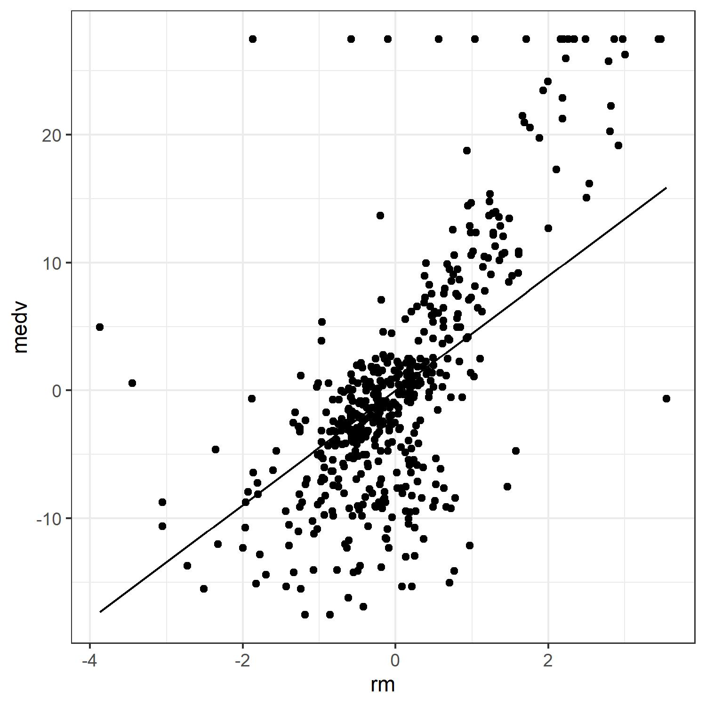

```{r, include = FALSE}
knitr::opts_chunk$set(
  collapse = TRUE,
  comment = "#>", 
  warning = FALSE
)
```

The goal of the **robustlm** package is to carry out robust variable selection through exponential squared loss [@wangRobustVariableSelection2013]. Specifically, it solves the following optimization problem: 

\[
\arg\min_{\beta} \sum_{i=1}^n(1-\exp\{-(y_i-x_i^T\beta)^2/\gamma_n\})+n\sum_{i=1}^d \lambda_{n j}|\beta_{j}|, 
\]
where penalty function is the well-known adaptive LASSO [@zou2006alasso]. 
<!-- \[ -->
<!-- \arg\min_{\beta} \sum_{i=1}^n(1-exp\{-(y_i-x_i^T\beta)^2/\gamma_n\})+n\sum_{i=1}^d p_{\lambda_{nj}}(|\beta_j|), -->
<!-- \] -->
<!-- where $p_{\lambda_{n j}}(|\beta_{j}|)=\lambda_{n j}|\beta_{j}|$ is the adaptive LASSO penalty.  -->
$y_i$s are responses and $x_i$ are predictors. $\gamma_n$ is the tuning parameter controlling the degree of robustness and efficiency of the regression estimators. Block coordinate gradient descent algorithm [@tsengCoordinateGradientDescent2009] is used to efficiently solve the optimization problem. The tuning parameter $\gamma_n$ and regularization parameter $\lambda_{nj}$ are chosen adaptively by default, while they can be supplied by the user. 

<!-- ## Installation -->

<!-- You can install the released version of robustlm from [CRAN](https://CRAN.R-project.org) with: -->

<!-- ``` r -->
<!-- install.packages("robustlm") -->
<!-- ``` -->

## Quick Start

This is a basic example which shows you how to use this package. First, we generate data which contain influential points in the response. Let covariate $x_i$ follows a multivariate normal distribution $N(0, \Sigma)$ where $\Sigma_{ij}=0.5^{|i-j|}$, and the error term $\epsilon$ follows a mixture normal distribution $0.8N(0,1)+0.2N(10,6^2)$. The response is generated by $Y=X^T\beta+\epsilon$, where $\beta=(1, 1.5, 2, 1, 0, 0, 0, 0)^T$.
```{r}
set.seed(1)
library(MASS)
N <- 1000
p <- 8
rho <- 0.5
beta_true <- c(1, 1.5, 2, 1, 0, 0, 0, 0)
H <- abs(outer(1:p, 1:p, "-"))
V <- rho^H
X <- mvrnorm(N, rep(0, p), V)

# generate error term from a mixture normal distribution
components <- sample(1:2, prob=c(0.8, 0.2), size=N, replace=TRUE)
mus <- c(0, 10)
sds <- c(1, 6)
err <- rnorm(n=N,mean=mus[components],sd=sds[components])

Y <- X %*% beta_true + err
```

Regression diagnostics for simple linear regression provide some intuition about the data.
```{r}
plot(lm(Y ~ X))
```

The Q-Q plot suggests the normal assumption is not valid. Thus, a robust variable selection procedure is needed. We apply *robustlm* function to select important variables:
```{r}
library(robustlm)
robustlm1 <- robustlm(X, Y)
robustlm1
```
The estimated regression coefficients $(0.94, 1.58, 2.07, 0.95, 0.00, 0.00, 0.00, 0.00)$ are close to the true values$(1, 1.5, 2, 1, 0, 0, 0, 0)$. There is no mistaken selection or discard. 

**robustlm** package also provides generic *coef* function to extract estimated coefficients and *predict* function to make a prediction:
```{r}
coef(robustlm1)
Y_pred <- predict(robustlm1, X)
head(Y_pred)
```


## Boston Housing Price Dataset
We apply this package to analysis the Boston Housing Price Dataset, which is available in **MASS** package. The data contain 14 variables and 506 observations. The response variable is medv (median value of owner-occupied homes in thousand dollars), and the rest are the predictors. Here the predictors are scaled to have zero mean and unit variance. The responses are centerized.
```{r}
data(Boston, package = "MASS")
head(Boston)
```

```{r}
# scaling and centering
Boston[, -14] <- scale(Boston[, -14])
Boston[, 14] <- scale(Boston[, 14], scale = FALSE)

# diagnostic
set.seed(1)
x <- as.matrix(Boston[, -14])
y <- Boston[, 14]
lm_OLS <- lm(y ~ x - 1)
plot(lm_OLS)
```

The diagnostic plots suggest the residuals may not follow normal distribution, we use **robustlm** to carry out variable selection with robustness.

```{r}
# robustlm
robustlm2 <- robustlm(x, y)
coef(robustlm2)
```

In this example, **robustlm** selected seven of the predictors while discarding six of them. Take a look at the correlations, it appears **robustlm** tends to select variables which have higher correlations with the response.
```{r}
cor(x, y)
```

The following procedure roughly illustrates the robustness. Take the predictor rm (average number of rooms per dwelling) as an example. We draw a 2-dimensional scatter plot with the fitted regression line on it. As shown below, the fitted line is not heavily affected by the outliers. 

<center>

<center>

```{r, fig.align='center', fig.keep='all', echo=FALSE, eval=FALSE}
beta <- robustlm2$beta
fun6 <- function(z) beta[6]*z 
library(ggplot2)
data6 <- data.frame(medv=y, rm=x[,6])
p <- ggplot(data = data6, aes(x=rm, y=medv)) +
  geom_function(fun = fun6) +
  geom_point() + theme_bw()
p
ggsave(p, filename = "boston.jpg", height = 3.6, width = 3.6)
```


```{r, eval=FALSE, echo=FALSE}
for (i in 1:13) {
  beta <- robustlm2$beta
fun <- function(z) beta[i]*z 
library(ggplot2)
data <- data.frame(y=y, x=x[,i])
pl <- ggplot(data = data, aes(x=x, y=y)) +
  geom_function(fun = fun) +
  geom_point()
print(pl)
}
```


# References


